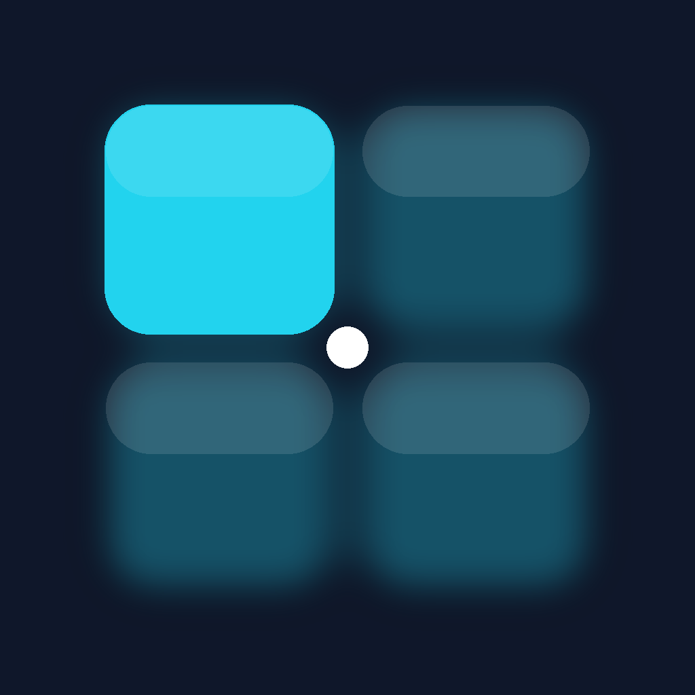
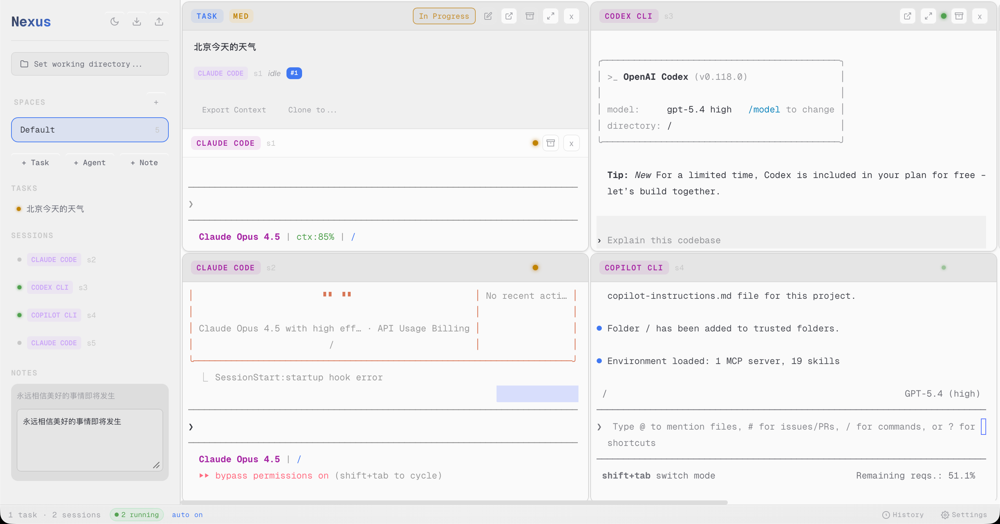
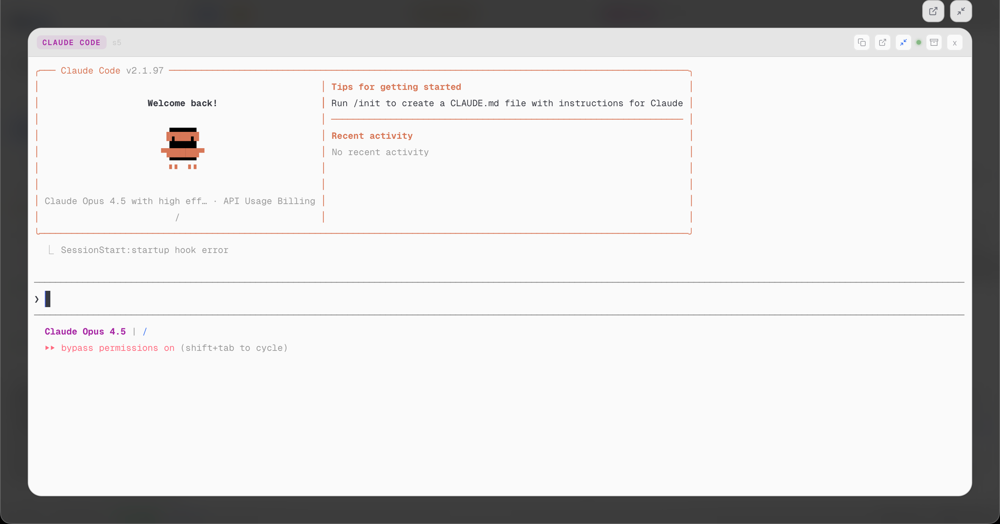

# Nexus

<p align="center">
  
</p>

<p align="center">
  <b>Tiling workspace for AI coding agents</b><br>
  <b>AI 编程代理的平铺式工作空间</b><br>
  Zig core + system WebView • Low memory footprint • Multi-agent orchestration
</p>

<p align="center">
  <a href="#what-it-does">English</a> | <a href="#功能特性">中文</a>
</p>

---

## What it does

- **Auto-tiling terminals** — Grid layout that automatically arranges panes
- **Run any CLI agent** — Claude Code, Codex, Copilot CLI, or any terminal program
- **Spaces** — Organize work into separate spaces, each with its own terminals and tasks
- **Task management** — Create tasks, assign to agents, track progress
- **Persistent workspaces** — Layout and state survive app restarts (SQLite-backed)
- **Lightweight** — ~3MB binary, ~30-50MB RAM (vs Electron's 200-300MB)
- **macOS native** — System WebView, native menus, Cmd+Q/C/V/X/A support

## Installation

### Download

Go to the [Releases](../../releases) page and download the DMG for your Mac:
- **Apple Silicon** (M1/M2/M3): `Nexus-*-aarch64.dmg`
- **Intel**: `Nexus-*-x86_64.dmg`

For bleeding-edge builds, check the nightly releases (tagged `nightly-*`).

### Install

1. Open the downloaded DMG
2. Drag `Nexus.app` to your Applications folder
3. **Important:** Before first launch, run this command in Terminal to remove quarantine:

```bash
xattr -cr /Applications/Nexus.app
```

4. Open Nexus from Applications or Spotlight

> **Why is this needed?** The app is ad-hoc signed (not notarized by Apple). macOS blocks unsigned apps by default. The `xattr -cr` command clears the quarantine attribute so you can run it.

## Screenshots

<p align="center">
  
</p>

<p align="center">
  
</p>

## Architecture

```
┌─────────────────────────────────────────────────────────────┐
│  Zig Daemon                                                 │
│  • PTY pool (forkpty)                                       │
│  • Session lifecycle management                             │
│  • SQLite persistence (~/.nexus/nexus.db)                     │
│  • HTTP static server + WebSocket JSON-RPC                  │
└──────────────────────────┬──────────────────────────────────┘
                           │ WebSocket
┌──────────────────────────┴──────────────────────────────────┐
│  System WebView                                             │
│  • Preact + Signals (reactive state)                        │
│  • xterm.js (terminal emulation)                            │
│  • CSS Grid (auto-tiling layout)                            │
│  • Glassmorphism UI                                         │
└─────────────────────────────────────────────────────────────┘
```

## Build

**Requirements:** Zig 0.15+, Node.js 20+

Release app bundles should rewrite the Mach-O minimum macOS version to 12.0 before signing. The GitHub release workflow already does this with `xcrun vtool`.

```bash
# Build frontend
cd frontend && npm install && npm run build && cd ..

# Run development
zig build run

# Build release
zig build -Doptimize=ReleaseFast
```

## Testing

```bash
# Frontend functional/unit coverage
npm --prefix frontend run test:run

# Backend Zig coverage
zig build test

# Run both test suites
./tests/run-functional-tests.sh
```

### Package as macOS App

```bash
# Build release binary
zig build -Doptimize=ReleaseFast

# Create app bundle structure
mkdir -p Nexus.app/Contents/{MacOS,Resources}
cp zig-out/bin/nexus Nexus.app/Contents/MacOS/nexus
cp -r frontend/dist/* Nexus.app/Contents/Resources/static/

# Lower the app bundle minimum macOS version to 12.0
CURRENT_SDK="$(xcrun --sdk macosx --show-sdk-version)"
xcrun vtool -set-build-version macos 12.0 "$CURRENT_SDK" \
  -replace \
  -output Nexus.app/Contents/MacOS/nexus.patched \
  Nexus.app/Contents/MacOS/nexus
mv Nexus.app/Contents/MacOS/nexus.patched Nexus.app/Contents/MacOS/nexus

# Sign for local use
xattr -cr Nexus.app && codesign --force --deep --sign - Nexus.app

# Run
open Nexus.app
```

## Keyboard Shortcuts

| Key | Action |
|-----|--------|
| Cmd+T | New task |
| Cmd+K | New agent |
| Cmd+J | New note |
| Cmd+W | Close focused pane |
| Cmd+1..9 | Focus pane by index |
| Cmd+C/V/X | Copy/Paste/Cut |
| Cmd+A | Select all |
| Cmd+Z | Undo |
| Cmd+Q | Quit |

## Project Structure

```
├── src/
│   ├── main.zig      # Entry point, WebView setup
│   ├── ipc.zig       # WebSocket JSON-RPC server
│   ├── pty.zig       # PTY spawning and management
│   ├── session.zig   # Session lifecycle
│   ├── db.zig        # SQLite persistence
│   ├── macos.zig     # macOS native features (menus, dialogs)
│   └── notify.zig    # System notifications
├── frontend/
│   ├── src/
│   │   ├── app.tsx           # Main app component
│   │   ├── store.ts          # State management (Signals)
│   │   ├── ipc.ts            # WebSocket client
│   │   ├── components/       # UI components
│   │   └── theme/            # CSS tokens and styles
│   └── package.json
├── build.zig
└── README.md
```

## License

MIT. See [LICENSE](LICENSE).

---

## Roadmap

### Planned Features

- [ ] **Rich content rendering** — Render git diff, markdown, code blocks natively in-app (no external viewer)
- [ ] **Plan mode interception** — Capture Claude Code's plan mode output and notify users for review/approval
- [ ] **CC Switch integration** — Built-in model/config switching, integrated with [cc-switch](https://github.com/user/cc-switch) project
- [ ] **Frontend redesign** — Modern, polished UI with improved aesthetics and UX
- [ ] **Workspace analytics** — Summarize and analyze workspace activity, agent performance, and task completion

### Completed

- [x] Auto-tiling terminal grid
- [x] Multi-agent orchestration
- [x] SQLite persistence
- [x] Nightly release builds

---

# 中文文档

## 功能特性

- **自动平铺终端** — 网格布局自动排列窗格
- **运行任意 CLI 代理** — Claude Code、Codex、Copilot CLI 或任何终端程序
- **工作空间** — 将工作组织到独立空间，每个空间有自己的终端和任务
- **任务管理** — 创建任务、分配给代理、跟踪进度
- **持久化工作空间** — 布局和状态在重启后保留（SQLite 存储）
- **轻量级** — 约 3MB 二进制文件，约 30-50MB 内存（对比 Electron 的 200-300MB）
- **macOS 原生** — 系统 WebView、原生菜单、Cmd+Q/C/V/X/A 支持

## 安装

### 下载

前往 [Releases](../../releases) 页面下载适合你 Mac 的 DMG：
- **Apple Silicon** (M1/M2/M3): `Nexus-*-aarch64.dmg`
- **Intel**: `Nexus-*-x86_64.dmg`

如需最新开发版，可下载 nightly 构建（标签为 `nightly-*`）。

### 安装步骤

1. 打开下载的 DMG 文件
2. 将 `Nexus.app` 拖到「应用程序」文件夹
3. **重要：** 首次启动前，在终端运行以下命令移除隔离属性：

```bash
xattr -cr /Applications/Nexus.app
```

4. 从启动台或 Spotlight 打开 Nexus

> **为什么需要这一步？** 应用使用 ad-hoc 签名（未经 Apple 公证）。macOS 默认阻止未签名应用运行。`xattr -cr` 命令清除隔离属性，使应用可以正常启动。

## 架构

```
┌─────────────────────────────────────────────────────────────┐
│  Zig 守护进程                                                │
│  • PTY 池 (forkpty)                                         │
│  • 会话生命周期管理                                           │
│  • SQLite 持久化 (~/.nexus/nexus.db)                        │
│  • HTTP 静态服务器 + WebSocket JSON-RPC                      │
└──────────────────────────┬──────────────────────────────────┘
                           │ WebSocket
┌──────────────────────────┴──────────────────────────────────┐
│  系统 WebView                                                │
│  • Preact + Signals (响应式状态)                             │
│  • xterm.js (终端模拟)                                       │
│  • CSS Grid (自动平铺布局)                                    │
│  • 毛玻璃风格 UI                                              │
└─────────────────────────────────────────────────────────────┘
```

## 构建

**依赖：** Zig 0.15+, Node.js 20+

发布版 app bundle 在签名前需要把 Mach-O 的最低 macOS 版本改成 12.0。GitHub release workflow 已经用 `xcrun vtool` 做了这一步。

```bash
# 构建前端
cd frontend && npm install && npm run build && cd ..

# 开发模式运行
zig build run

# 构建发布版
zig build -Doptimize=ReleaseFast
```

## 测试

```bash
# 前端功能/单元测试
npm --prefix frontend run test:run

# 后端 Zig 测试
zig build test

# 运行全部测试
./tests/run-functional-tests.sh
```

### 打包为 macOS 应用

```bash
# 构建发布版二进制
zig build -Doptimize=ReleaseFast

# 创建应用包结构
mkdir -p Nexus.app/Contents/{MacOS,Resources}
cp zig-out/bin/nexus Nexus.app/Contents/MacOS/nexus
cp -r frontend/dist/* Nexus.app/Contents/Resources/static/

# 把 app bundle 的最低 macOS 版本降到 12.0
CURRENT_SDK="$(xcrun --sdk macosx --show-sdk-version)"
xcrun vtool -set-build-version macos 12.0 "$CURRENT_SDK" \
  -replace \
  -output Nexus.app/Contents/MacOS/nexus.patched \
  Nexus.app/Contents/MacOS/nexus
mv Nexus.app/Contents/MacOS/nexus.patched Nexus.app/Contents/MacOS/nexus

# 本地签名
xattr -cr Nexus.app && codesign --force --deep --sign - Nexus.app

# 运行
open Nexus.app
```

## 快捷键

| 按键 | 操作 |
|-----|--------|
| Cmd+T | 新建任务 |
| Cmd+K | 新建代理 |
| Cmd+J | 新建笔记 |
| Cmd+W | 关闭当前窗格 |
| Cmd+1..9 | 按索引聚焦窗格 |
| Cmd+C/V/X | 复制/粘贴/剪切 |
| Cmd+A | 全选 |
| Cmd+Z | 撤销 |
| Cmd+Q | 退出 |

## 路线图

### 计划中的功能

- [ ] **富内容渲染** — 在应用内原生渲染 git diff、markdown、代码块（无需外部查看器）
- [ ] **Plan 模式拦截** — 捕获 Claude Code 的 plan 模式输出，提醒用户审查/批准
- [ ] **CC Switch 集成** — 内置模型/配置切换，与 [cc-switch](https://github.com/user/cc-switch) 项目联动
- [ ] **前端重设计** — 现代化、精致的 UI，改进美观度和用户体验
- [ ] **工作空间分析** — 总结和分析工作空间活动、代理性能和任务完成情况

### 已完成

- [x] 自动平铺终端网格
- [x] 多代理编排
- [x] SQLite 持久化
- [x] Nightly 发布构建

## 许可证

MIT. 见 [LICENSE](LICENSE)。
